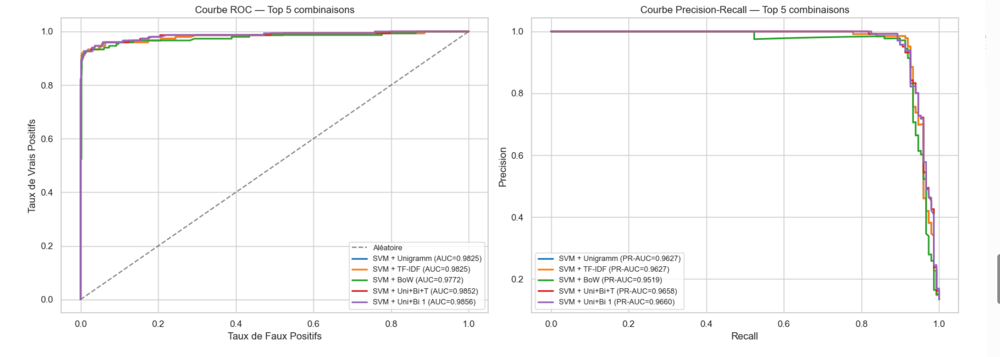

# 📧 Spam Detection — NLP Pipeline & Comparaison de Modèles


Pipeline complet de **détection de spam** en NLP : comparaison systématique de plusieurs représentations vectorielles du texte et de plusieurs modèles de classification, pour identifier la combinaison la plus performante.

🏆 **Meilleur résultat** : **SVM + TF-IDF (Uni+Bigrammes)** → **ROC-AUC = 0.9856**, **PR-AUC = 0.9660**

---

## 🎯 Objectif

Classer automatiquement des messages SMS/texte en **spam** ou **ham** (non-spam), en comparant méthodiquement différentes approches de vectorisation du texte et différents algorithmes de classification, afin d'identifier la combinaison offrant le meilleur compromis précision/rappel.

## 🖼️ Résultats


*Le SVM domine nettement sur les 5 meilleures combinaisons, avec un ROC-AUC allant jusqu'à 0.9856 et un PR-AUC jusqu'à 0.9660 (Uni+Bigrammes)*


## 🔧 Installation

```bash
git clone https://github.com/imane-el-arrach/spam_detection.git
cd spam_detection

python -m venv .venv
source .venv/bin/activate  # Windows : .venv\Scripts\activate

pip install pandas numpy matplotlib seaborn scikit-learn nltk wordcloud scipy
```

## 🚀 Utilisation

Le pipeline est découpé en plusieurs notebooks, à exécuter dans l'ordre :

```bash
jupyter notebook
```

1. `data_exploration.ipynb` — exploration initiale du dataset
2. `cleaning_preprocessing.ipynb` — nettoyage et prétraitement du texte
3. `feature_engineering.ipynb` — construction des représentations vectorielles (BoW, TF-IDF, n-grams)
4. `models.ipynb` — entraînement des modèles de classification
5. `evaluation_finale.ipynb` — comparaison finale des performances (courbes ROC/PR, conclusions)

## 📊 Dataset

[UCI SMS Spam Collection](https://archive.ics.uci.edu/ml/datasets/SMS+Spam+Collection) — 5574 messages, dont 747 spam (13.4%)

## 🧪 Ce qu'on compare

### Représentations vectorielles

| Méthode | Classe sklearn | Paramètre clé |
|---------|---------------|---------------|
| Bag of Words | `CountVectorizer` | `max_features` |
| TF-IDF | `TfidfVectorizer` | `sublinear_tf=True` |
| Bigrammes | `TfidfVectorizer` | `ngram_range=(2,2)` |
| Uni+Bi | `TfidfVectorizer` | `ngram_range=(1,2)` |

### Modèles

| Modèle | Classe sklearn | Paramètre clé |
|--------|---------------|---------------|
| Naive Bayes | `MultinomialNB` | `alpha` (lissage) |
| SVM | `LinearSVC` | `C` (régularisation) |
| Logistic Regression | `LogisticRegression` | `C` |
| Random Forest | `RandomForestClassifier` | `n_estimators` |

### Métriques

- **Accuracy** — proportion de prédictions correctes
- **Precision** — parmi les spams détectés, combien sont vrais ?
- **Recall** — parmi les vrais spams, combien sont détectés ?
- **F1-score** — moyenne harmonique precision/recall (métrique principale, vu le déséquilibre des classes)
- **ROC-AUC** — aire sous la courbe ROC

## 💡 Conclusions

**Représentations vectorielles**
- **BoW** : simple et efficace comme baseline. Les fréquences brutes suffisent pour des cas évidents.
- **TF-IDF** : généralement meilleur que BoW car il réduit l'importance des mots trop communs.
- **N-grams** : capturent des patterns caractéristiques du spam comme *"click here"* ou *"free prize"*.

**Modèles**
- **SVM** : le meilleur modèle en haute dimension. Robuste, peu de réglages nécessaires — c'est la combinaison gagnante ici.
- **Naive Bayes** : excellent ratio performance/vitesse.
- **Logistic Regression** : performances similaires au SVM, mais plus interprétable.
- **Random Forest** : décevant sur du texte TF-IDF (arbres de décision + haute dimensionnalité = pas optimal).

**Pré-traitement**
- La **lemmatisation** > stemming pour la qualité, mais le stemming reste souvent suffisant.
- La **suppression des stop words** est très importante pour BoW, moins cruciale avec TF-IDF.

## 📂 Structure du projet

```
spam_detection1/
├── data_raw.csv                    # Dataset brut
├── data_preprocessed.csv           # Dataset après nettoyage
├── data_exploration.ipynb          # 1. Exploration initiale
├── cleaning_preprocessing.ipynb    # 2. Nettoyage & prétraitement du texte
├── feature_engineering.ipynb       # 3. Vectorisation (BoW, TF-IDF, n-grams)
├── models.ipynb                    # 4. Entraînement des modèles
├── evaluation_finale.ipynb         # 5. Comparaison & conclusions
├── screenshots/                    # Visuels utilisés dans ce README
└── README.md
```

## 👩‍💻 Auteure

**Imane El Arrach** — Élève-ingénieure en Génie Informatique, spécialité Ingénierie des Données & IA, ENSA Safi
[LinkedIn](https://www.linkedin.com/in/imane-el-arrach-7a88ab325/) · [GitHub](https://github.com/imane-el-arrach)
